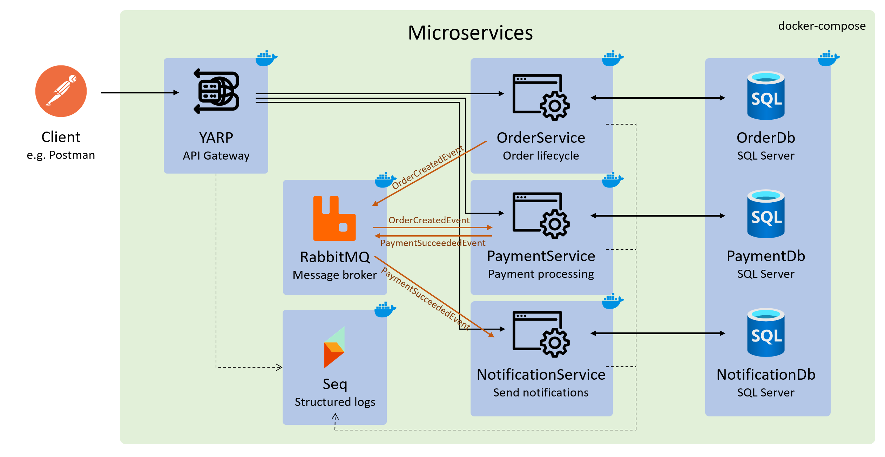
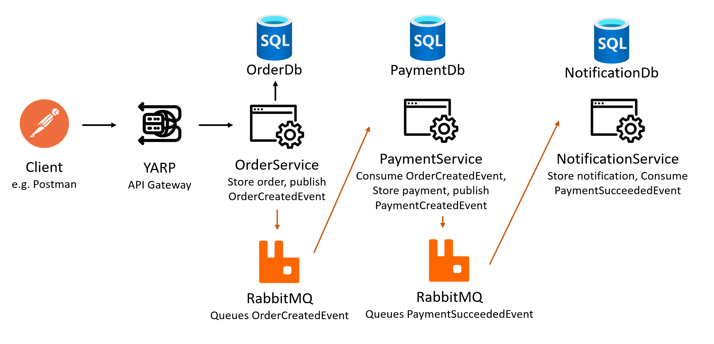

# .NET Microservices Take-Home Assignment

## Overview
This project is a small microservices-based Order Processing System built in **.NET**, using **event-driven architecture**. 

In this system, a client is able to initiate an "order creation", which triggers payment processing and notification delivery. This is achieved with 3 separate microservices: 
- `OrderService` for order creation
- `PaymentService` for payment processing
- `NotificationService` for sending notifications. 

Because of the architecture, services are independently deployable, and communicate asynchronously via events. I specifically avoided direct API calls between services, to avoid coupling.

The tech stack for this project includes:
- `C#/.NET 9` for the services
- `xUnit` + `Moq` + `FluentAssertions` for Unit tests. 
- `RabbitMQ` for the message broker
- `Serilog` with `Seq` for structured logging
- `YARP` for the API Gateway
- `Docker` to containerize each application
- `docker-compose` to orchestrate deployment

Throughout this assignment, I prioritised clean layering, clear service boundaries, and maintainable code, with responsibilities separated across API, application, domain, and infrastructure layers. 

On top of that, I added safety rails on the service level to accommodate for the event of network failures such as retries, idempotency and the outbox pattern - more details in [Design Decisions](#design-decisions). I prioritised these features over additional "production hardening" features such as authentication middleware, rate limiting, and including integration tests.

The rest of this README consists of a quick start guide, service URLs, event flow, design decisions, testing, limitations and future improvements.

## Architecture Diagram



## Quick Start
The easiest way to get this project running is using Docker. Please ensure you have it installed: [Docker Engine](https://docs.docker.com/engine/install/) / [Docker Desktop](https://docs.docker.com/desktop/). Run all steps from the repo root.

1. Run `docker compose up --build` to build the images and run the containers. If it's your first time running it, it may take a while to pull all the relevant images.
2. Run the following health check scripts to check all the containers and services are running and healthy:

    Linux/macOS/Git Bash:
    ```
    bash scripts/health-check.sh
    ```
    Windows PowerShell:
    ```
    .\scripts\health-check.ps1
    ```
    Expected result: all checks print `PASS`.

    Alternatively, check container status via Docker Desktop and ping `localhost:5000/health` (also check ports `5211`, `5104` and `5030`).

3. Access the services through the API gateway (default is `localhost:5000`)
4. A Postman collection is provided in `OrderProcessingSystem.postman_collection.json`, which can be imported directly into Postman to test the endpoints. 
5. If you have a dotnet SDK installed, you can run `dotnet test` in the root of the project to run the unit tests.

### Exiting containers
To stop running the Order Processing System, you can run `docker compose down`, or `docker compose down -v` to remove volumes.

## Service URLs
The available services can be accessed at the following URLs:

- RabbitMQ UI:
    - `localhost:15672/` (username: guest, password: guest)
- Seq:
    - `localhost:8081/` (username: admin, password: AdminPassword1!)
    - Note: you may need to update the password on first init
- API Gateway:
    - `localhost:5000`
- OrderService:
    - `localhost:5000/api/orders`: through API gateway
    - `localhost:5211/api/orders`: directly
    - `localhost:5211/scalar/v1`: Scalar OpenAPI documentation
- PaymentService:
    - `localhost:5000/api/payments`: through API gateway
    - `localhost:5104/api/payments`: directly
    - `localhost:5104/scalar/v1`: Scalar OpenAPI documentation
- NotificationService:
    - `localhost:5000/api/notifications`: through API gateway
    - `localhost:5030/api/notifications`: directly
    - `localhost:5030/scalar/v1`: Scalar OpenAPI documentation

## Event Flow


### Flow
1. When a client sends a POST Order request (create new order) through the API gateway, the reverse proxy will route it to the OrderService.
2. The OrderService will store the Order in the OrderDb, and publish an event `OrderCreatedEvent` to the message broker, in this case RabbitMQ.
3. The PaymentService listens for `OrderCreatedEvent`, and when it receives one it will simulate making a payment. Then, it will publish a `PaymentSucceededEvent` to RabbitMQ and store the payment in the PaymentDb.
4. The NotificationService listens for `PaymentSucceededEvent` and logs a message to Seq, simulating sending a notification, and stores the notification in the NotificationDb.

### Reliability
An outbox pattern was enabled in OrderService and PaymentService when publishing events. This is done by ensuring the DB write and the outgoing message is executed in a single transaction, and a separate message dispatcher reads from the outbox and publishes to RabbitMQ. This prevents data inconsistency in the event RabbitMQ is temporarily down.

I also configured MassTransit to retry (500ms → 1s → 5s) in the `MassTransitExtensions` in `BuildingBlocks`, which both services use. 

I implemented consumer-side idempotency: if a duplicate event is delivered, repository checks + unique DB constraints prevent duplicate records (`OrderId` unique in PaymentService, `PaymentId` unique in NotificationService).

### Observability

Additionally, I added CorrelationIds, which are passed through the headers `X-Correlation-ID`, configured in the middleware `CorrelationIdMiddleware`, and are eventually logged. This allows a user going through Seq logs to follow the entire journey of a transaction.

### Verifying end-to-end
- Send a `POST /api/orders` request via Postman (it's provided)
- Check in Seq logs for "Received OrderCreatedEvent". The CorrelationId associated with this can be pasted in the search bar to verify:
    - the PaymentService receives the OrderCreatedEvent
    - the PaymentService processes the payment
    - the NotificationService receives the PaymentSucceededEvent
- Call
    - `GET /api/payments` to verify the payment is stored
    - `GET /api/notifications` to verify the notification is stored

## Design Decisions

## Testing Strategy

## Known Limitations

## Future Improvements